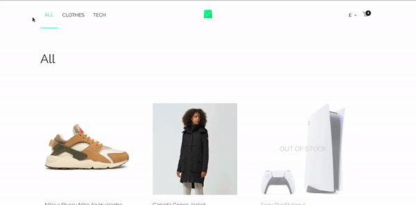
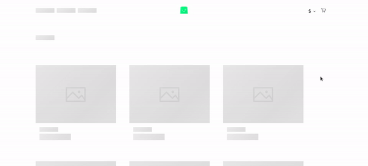

<div id="top"></div>

<br />
<div align="center">
  <h3 align="center">Kudzai Mabika | Scandiweb Junior React Test</h3>
</div>
<br />

## Scandiweb x Kudzai Store

<br/>



A webapp using React.js written as part of the Scandiweb Junior Developer test assignment.

<p align="right">(<a href="#top">back to top</a>)</p>

### Built With

- [react.js](https://reactjs.org/)
- [redux](https://redux.js.org/)
- [styled-components](https://styled-components.com/docs)
- [graphql](https://graphql.org/)
- [opus](https://github.com/tilework/opus)

### Architecture 
 - Container Component

### Project Files
- [figma files](https://www.figma.com/file/MSyCAqVy1UgNap0pvqH6H3/Junior-Frontend-Test-Designs-(Public)?node-id=91580%3A2)
- [graphql-endpoint](https://www.figma.com/file/MSyCAqVy1UgNap0pvqH6H3/Junior-Frontend-Test-Designs-(Public)?node-id=91580%3A2)

<p align="right">(<a href="#top">back to top</a>)</p>

## Getting Started

### Prerequisites

Install the server and run the server.

- npm
  ```sh
  git clone https://github.com/scandiweb/junior-react-endpoint
  ```
- yarn
  ```sh
  yarn install
  ```
- start server
  ```sh
  yarn start
  ```

### Scandiweb Client

Ensure the server is running and start the client.

1. clone the repo
   ```sh
   git clone https://github.com/kmabika/minimal-store-scandiweb
   ```
2. install packages
   ```sh
   yarn install
   ```
3. start client
   ```sh
   yarn start
   ```

<p align="right">(<a href="#top">back to top</a>)</p>

## Added Pages
- Skeleton Loader

